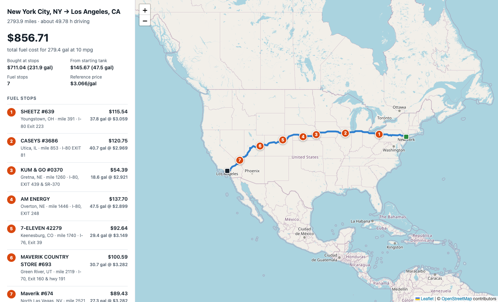

# Fuel Route Planner

[](https://github.com/Rajaa786/fuel-route-planner/actions/workflows/ci.yml)

A Django API that takes a start and a finish location in the USA and returns the driving
route, the cheapest places to refuel along it, and the total fuel cost, for a vehicle with a
500-mile range that achieves 10 miles per gallon.



| Requirement | How it is met |
|---|---|
| Latest stable Django | Django 6.1.1 on Python 3.13, Django REST Framework 3.18 |
| Start and finish in the USA | A city (state optional), `lat,lon`, an address or a ZIP code; cities resolve offline |
| Map of the route | GeoJSON line in the response, plus `map_url`, an interactive map page |
| Optimal fuel stops, by cost | Exact dynamic programme over the stations along the route |
| 500-mile range, several fuel-ups | Tank and range constraints are part of the optimisation |
| Total money spent at 10 mpg | `summary.total_fuel_cost` prices every gallon the trip burns |
| Fuel prices from the provided file | `data/fuel-prices-for-be-assessment.csv`, imported once |
| Fast | About 10 ms for a repeated route; a new route costs one routing call plus about 25 ms |
| One call to the routing API | Exactly one per new route, zero for a repeated one (`meta.external_api_calls`) |

## Run it

Requires Python 3.12 or newer. With [uv](https://docs.astral.sh/uv/):

```bash
cp .env.example .env
uv sync
uv run python manage.py migrate
uv run python manage.py bootstrap_data     # loads the gazetteer and the fuel stations, ~5 s
uv run python manage.py runserver
```

Without uv:

```bash
cp .env.example .env
python3 -m venv .venv && source .venv/bin/activate
pip install -r requirements.txt
python manage.py migrate && python manage.py bootstrap_data && python manage.py runserver
```

`requirements.txt` holds the runtime dependencies only; to run the tests that way, also
`pip install pytest pytest-django ruff`.

Then:

- Plan: <http://127.0.0.1:8000/api/v1/route-plan/?start=New%20York,%20NY&finish=Los%20Angeles,%20CA>
- Map: <http://127.0.0.1:8000/api/v1/route-plan/map/?start=New%20York,%20NY&finish=Los%20Angeles,%20CA>
- Swagger UI: <http://127.0.0.1:8000/api/docs/>
- Postman: import `docs/fuel-route-planner.postman_collection.json`

Tests and lint: `uv run pytest` and `uv run ruff check .`

## API

### `GET /api/v1/route-plan/`

| Parameter | Required | Description |
|---|---|---|
| `start` | yes | A US location; see below |
| `finish` | yes | Same |
| `stop_penalty` | no | Dollars a stop must save to be worth making. Default 2. `0` gives the strictly cheapest plan |

Locations are free text, and neither the state nor the comma is required for a large city:

| You type | Resolved | External calls |
|---|---|---|
| `Chicago, IL` · `Chicago IL` · `chicago, illinois` · `Chicago Illinois` · `Chicago` | Offline gazetteer | 0 |
| `NYC` · `LA` · `New York` · `Washington DC` | Offline gazetteer | 0 |
| `41.8781,-87.6298` | Used as is | 0 |
| `Big Cabin, OK` (any town, once the state is given) | Offline gazetteer | 0 |
| `233 S Wacker Dr, Chicago, IL` · `10001` · `Statue of Liberty` · `Big Cabin` | Geocoder | 1, then cached |
| `Springfield` · `Peoria` · `Wyoming` | Refused: `422 location_ambiguous` | 0 |

A name is resolved only when that is not a guess. `Columbus` is Columbus, OH, four times the
size of its namesake. `Peoria` could be Arizona or Illinois, so it is refused and the
response lists both; so is a bare state name. A small town typed without its state, or
anything else the gazetteer cannot settle, goes to the geocoder, and a foreign match
(`Toronto`, `Naples`) is rejected with what was understood rather than swapped for a US
namesake. `start.name` and `finish.name` always show what was understood.

Response (New York to Los Angeles, geometry and most stops trimmed):

```json
{
  "start": {"query": "New York, NY", "name": "New York City, NY", "latitude": 40.71427,
            "longitude": -74.00597, "resolved_by": "gazetteer"},
  "finish": {"query": "Los Angeles, CA", "name": "Los Angeles, CA", "latitude": 34.05223,
             "longitude": -118.24368, "resolved_by": "gazetteer"},
  "route": {
    "distance_miles": 2793.9,
    "duration_hours": 49.78,
    "geometry": {"type": "LineString", "coordinates": [[-74.00597, 40.71427], "..."]}
  },
  "fuel_stops": [
    {"stop": 1, "opis_id": 72445, "name": "SHEETZ #639", "address": "I-80 Exit 223",
     "city": "Youngstown", "state": "OH", "price_per_gallon": 3.059, "mile_marker": 390.5,
     "miles_off_route": 3.7, "latitude": 41.14908, "longitude": -80.67543,
     "fuel_on_arrival_gallons": 10.95, "gallons": 37.77, "cost": 115.54}
  ],
  "optional_top_up": null,
  "summary": {
    "total_fuel_cost": 856.71,
    "fuel_purchased_cost": 711.04,
    "starting_fuel_cost_estimate": 145.67,
    "trip_fuel_gallons": 279.39,
    "detour_miles": 0.0,
    "gallons_purchased": 231.88,
    "starting_fuel_gallons_used": 47.51,
    "reference_price_per_gallon": 3.066,
    "reference_price_basis": "average_price_paid_at_stops",
    "fuel_stops": 7
  },
  "assumptions": {"vehicle_range_miles": 500.0, "miles_per_gallon": 10.0,
                  "tank_capacity_gallons": 50.0, "reserve_miles": 25.0,
                  "stop_penalty_usd": 2.0, "notes": ["..."]},
  "warnings": [],
  "map_url": "http://127.0.0.1:8000/api/v1/route-plan/map/?start=New+York%2C+NY&finish=Los+Angeles%2C+CA",
  "meta": {"routing_provider": "osrm", "external_api_calls": {"routing": 1, "geocoding": 0},
           "candidate_stations": 175, "corridor_miles": 5.0,
           "cheapest_possible_purchase_cost": 708.35, "upstream_ms": 1034.8, "elapsed_ms": 1053.7}
}
```

API errors share one shape, and `details` carries what is needed to correct the request:

```json
{"error": {"code": "location_not_found",
           "message": "Could not find a US location matching 'Qwertyuiop, ZZ'.",
           "details": {"query": "Qwertyuiop, ZZ", "accepted_formats": ["City, ST (e.g. 'Chicago, IL')", "..."]}}}
```

| Status | `code` | When |
|---|---|---|
| 400 | `invalid_request` | Missing or malformed parameter; `details` lists the fields |
| 422 | `location_not_found` | A location could not be resolved |
| 422 | `location_ambiguous` | Several comparable cities share the name, or it is a state; `details.candidates` lists them |
| 422 | `location_outside_service_area` | Outside the contiguous United States; `details.matched` says what was understood |
| 422 | `same_start_and_finish` | Both locations resolve to the same point |
| 422 | `no_route_found` | No drivable route joins the two points |
| 422 | `no_feasible_fuel_plan` | No station can be reached on some stretch within the planning range, counting the drive to stations off the route; `details` gives the stretch |
| 404 / 405 | `not_found` / `method_not_allowed` | Unknown URL / anything but `GET` |
| 429 | `rate_limited` | Client exceeded the request throttle |
| 502 / 504 | `upstream_unavailable` / `upstream_timeout` | The routing service failed or timed out |
| 503 | `upstream_rate_limited` / `fuel_data_not_loaded` | Routing service throttled us / `bootstrap_data` not run |
| 500 | `internal_error` | A bug; the traceback is logged, never returned |

Two exceptions to the JSON shape: the map endpoint reports the same failures as an HTML page,
and with `DJANGO_DEBUG=True` Django shows its own debug page for an unknown URL.

### `GET /api/v1/route-plan/map/`

Same query string. Returns the HTML map shown above. It reuses the cached route, so opening
the map after a plan request makes no further external call.

### `GET /health/`

`200 {"status": "ok", "fuel_stations": 6508}` once the data is loaded, `503` before.

## How it works

```
start, finish
   │  1. resolve      "lat,lon" literal → offline gazetteer (SQLite) → Nominatim (rare, cached)
   ▼
coordinates
   │  2. route        ONE OSRM call, full-resolution polyline (cached for 24 h)
   ▼
polyline
   │  3. match        decode → mile markers → resample every 0.25 mi → KD-tree →
   │                  every station within 5 mi of the road, with its mile marker
   ▼
candidates
   │  4. optimise     exact DP: minimise fuel cost + $2 per stop, under the tank constraints
   ▼
stops, cost, GeoJSON, map
```

**The fuel file has no coordinates.** Calling a geocoder 8,151 times was never an option, and
addresses such as `I-44, EXIT 283 & US-69` cannot be geocoded reliably anyway. Each station is
placed at its city's centroid using a gazetteer built from GeoNames and committed to the repo
(`data/us_places.csv.gz`, 3.2 MB). The same gazetteer resolves `"City, ST"` inputs, which is
why a typical request needs no geocoding call at all.

**Matching stations to the route is vector maths, not SQL.** The 6,508 stations live in numpy
arrays in memory. The route is resampled to a point every quarter mile, a KD-tree is built
over those points, and one query returns the nearest route point for every station. Its
position along the route is the station's mile marker.

**The optimiser is exact.** With the stations reduced to mile markers and prices, choosing
where to buy is the fixed-path gas station problem. The implementation is a dynamic programme
built on the structure result of Khuller, Malekian and Mestre ("To Fill or Not to Fill"): at
each stop, either fill the tank (the next stop is dearer) or buy just enough to reach the
next stop (it is cheaper). It runs in about a millisecond for a coast-to-coast route. The
test suite checks it against three independent oracles: a greedy algorithm, a linear
programme, and exhaustive search over every subset of stations.

**Strictly cheapest is not what a driver wants.** The cheapest New York to Los Angeles plan
has 14 stops, one of them for 1.3 gallons. The objective therefore includes a small price per
stop (`stop_penalty`, default $2): a stop is made only if it saves at least that much. The
result is 7 stops for $2.69 more fuel (0.4%). It is still an exact optimum of the stated
objective, `stop_penalty=0` returns the strictly cheapest plan, and
`meta.cheapest_possible_purchase_cost` shows the difference on every response. A small
purchase can still appear where the range forces it (two good stations slightly more than
one tank apart) or where it saves more than the penalty; a higher `stop_penalty` trades more
fuel cost for fewer stops.

### Measured performance

New York to Los Angeles (2,794 miles, 34,638 route points, 175 candidate stations), on a laptop:

| Step | Time |
|---|---|
| OSRM routing call (network) | 200–1,000 ms typical; the first call of a process can take 2–3 s |
| Decode polyline, mile markers, resample | 2.5 ms |
| Match 6,508 stations to the route | 5 ms |
| Optimise (twice: with and without stop penalty) | 3 ms |
| Simplify geometry for the response (first request only) | 16 ms |
| **Repeat request, end to end** | **about 10 ms** |

An input that needs the geocoder adds one Nominatim call per location, and those are spaced a
second apart to respect its usage policy.

## Assumptions

The ones that affect the numbers are also returned with every response, under `assumptions`.

- **The vehicle departs with a full tank.** The alternative, starting empty and filling up at
  the origin, is not possible with this data: the nearest station in the file is 121 miles
  from Los Angeles and 165 miles from San Francisco.
- **`total_fuel_cost` prices every gallon burned**, which is what "total money spent on fuel
  at 10 mpg" asks for. It is the money paid at the stops plus the fuel burned from the
  starting tank, valued at the average price paid at those stops. If no stop is needed, the
  starting-tank fuel is valued at the cheapest station on the route, which is returned as
  `optional_top_up`. The two components are reported separately.
- **A 25-mile reserve is kept**, so legs are planned to at most 475 miles. Station positions
  are only city-accurate; a plan that reaches a pump with exactly zero fuel would run dry in
  practice. No leg ever exceeds the 500-mile range.
- **Duplicate rows are one station.** 568 US station IDs appear on several rows, always with
  the same address and city, and 487 of them at different prices. They are merged and priced
  at the lowest quote.
- **A stop's `latitude`/`longitude` is the point on the route nearest the station's city.**
  Within the default 5-mile corridor the distance to the station is mostly geocoding noise
  (median under 2 miles) and is not counted. If no plan exists within 5 miles the corridor is
  widened to 10 and then 25 miles; those detours are real, so they are driven and paid for
  in the plan, reported as `summary.detour_miles`, and flagged in `warnings`. In that rare
  case two stations per town are considered (the cheapest and the nearest), so the plan is
  optimal over those candidates rather than over every station in the wider corridor.

## Limitations

- **Coverage follows the file.** California has 7 usable stations, all in the Imperial
  and Coachella valleys, so a long route that stays on the West Coast (Los Angeles to Seattle) has an
  877-mile stretch with no station and returns `422 no_feasible_fuel_plan`. Routes that leave
  California within a tank's range work.
- **Contiguous United States only.** The file has no stations in Alaska or Hawaii. The 620
  Canadian rows are not imported, because the gazetteer is US-only, so a US-to-US route that
  crosses Canada for more than 475 miles is infeasible. Shorter crossings (Detroit to Boston
  runs through Ontario) are planned normally and are not flagged.
- **118 of 6,626 US stations are skipped**: 18 whose city is not in the gazetteer and 100
  whose city name is ambiguous within its state. A missing station costs a little optimality;
  a misplaced one would put a stop on the map 100 miles from where it is.
- **The service-area check on raw coordinates is a bounding box**, so a point in southern
  Ontario or northern Mexico is accepted. Named places are checked by country: `Toronto`,
  `Toronto, ON` and `Mexico City` are rejected.
- **Geocoded inputs are only as good as the geocoder.** An address or landmark that names its
  city must be found within 60 miles of that city; if it is not, the city centre is used and
  `warnings` says so. Spelling matters to the geocoder: `350 5th Ave, New York, NY` is found,
  `350 Fifth Avenue, New York, NY` falls back to the city. A ZIP code resolves to OpenStreetMap's
  centroid for it, which can be a few miles off.
- **A re-import needs a restart.** The station index is loaded once per process, so a
  running server keeps the old prices until it is restarted.
- **OSRM's public demo server has no SLA.** `OSRM_BASE_URL` points the service at a
  self-hosted instance with no code change.
- **One process.** The cache, the station index and the throttle are per-process, and
  `gunicorn.conf.py` runs one worker with eight threads so they are exact. Scaling out means
  moving the cache to Redis first.

## Project layout

```
config/            settings (environment-driven), URL routing, WSGI/ASGI
domain/            framework-free core: optimizer.py, geometry.py, normalization.py
providers/         httpx clients for OSRM and Nominatim; no Django imports
apps/stations/     Place and FuelStation models, CSV import, in-memory station index
apps/planner/      location resolver, RoutePlanner service, API views, map page
data/              fuel price CSV, gazetteer
scripts/           build_gazetteer.py (regenerates the gazetteer from GeoNames)
tests/             263 tests; none touch the network
```

## Configuration

All settings come from environment variables; `.env.example` lists the common ones and
`config/settings.py` all of them. The ones that change behaviour: `FUEL_STOP_PENALTY_USD` (2.0), `FUEL_RESERVE_MILES` (25), `FUEL_CORRIDOR_TIERS_MILES`
(5,10,25), `OSRM_BASE_URL`, `API_THROTTLE_RATE` (120/min, shared by the JSON and map
endpoints), `NUM_PROXIES` (0; set to 1 behind a reverse proxy so clients are told apart by
the forwarded address).

Production: `DJANGO_DEBUG` defaults to off and `DJANGO_SECRET_KEY` is required. Run with
`gunicorn config.wsgi` (`gunicorn.conf.py` sets one worker, eight threads), or
`docker build -t fuel-route-planner . && docker run -p 8000:8000 -e DJANGO_SECRET_KEY=... fuel-route-planner`.
CI runs lint, the tests and Django's deployment checks, then builds the image and probes `/health/`.

## Data sources

- Fuel prices: the CSV supplied with the assignment.
- Routing: [OSRM](https://project-osrm.org/) public demo server, © OpenStreetMap contributors.
- Fallback geocoding: [Nominatim](https://nominatim.org/), © OpenStreetMap contributors.
- Gazetteer: [GeoNames](https://www.geonames.org/), CC BY 4.0.
